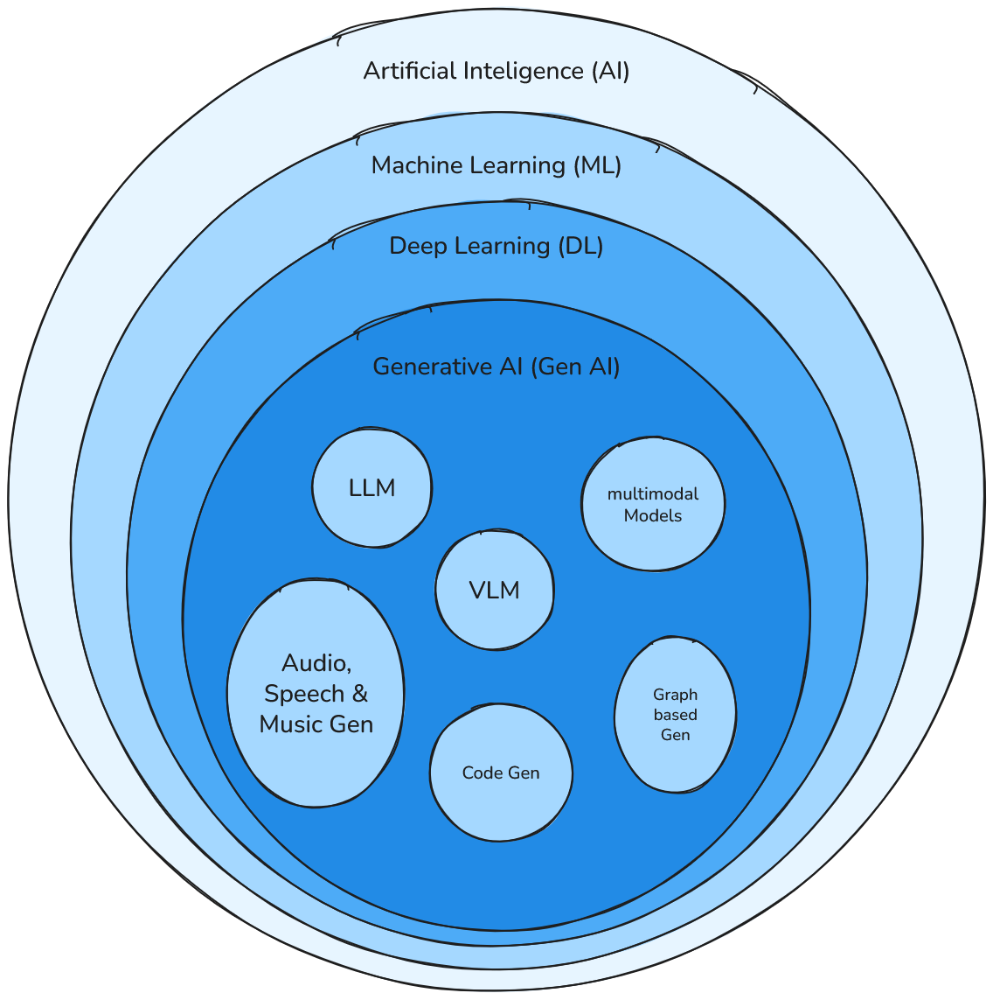

# Material de apoio - GenAI

Este material tem como objetivo apresentar fontes de estudo e referências multidisciplinares para uma imersão introdutória no campo da Inteligência Artificial, com foco em GenAI (Inteligência Artificial Generativa).

> :construction: 2025-06-25 — WIP (Work in Progress)


## Mapa conceitual (2025-06)

Este glossário apresenta alguns dos termos, não todos, porém serve como ponto de partida para contextualização dentre as tecnicas existentes.

A estrutura descrita a seguir descreve em detalhes a taxonomia descrita no diagrama de venn da figura abaixo.

<p align="center">
  
</p>


> Escolha um tópico de interesse, estude os conceitos e tecnologias.

```shell
Artificial Intelligence
└ Machine Learning
    ├── Supervised Learning
    │    ├── Linear & Logistic Regression
    │    ├── Decision Trees / XGBoost
    │    └── K-Nearest Neighbors (KNN)
    ├── Unsupervised Learning
    │    ├── Clustering (e.g., K-Means, DBSCAN)
    │    └── Dimensionality Reduction (PCA, UMAP)
    ├── Reinforcement Learning
    │    ├── Q-Learning
    │    └── Deep Reinforcement Learning (DQN, PPO)
    └── Deep Learning
         ├── Feedforward Neural Networks (FNN)
         ├── Convolutional Neural Networks (CNN)
         ├── Recurrent Neural Networks (RNN, LSTM, GRU)
         ├── Graph Neural Networks (GNNs)
         │   ├── Graph2Text
         │   └── Bioinformatics (e.g., molecule generation)
         ├── Autoencoders (VAE, Denoising)
         ├── Transformers
         │    ├── Encoder-only (BERT, DeBERTa)
         │    ├── Decoder-only (GPT family)
         │    └── Encoder-Decoder (T5, UL2)
         ├── Generative Adversarial Networks (GANs)
         ├── Diffusion Models (modern GAN alternative)
         └── Generative AI (GenAI)
             ├── Large Language Models (LLMs) - Foundation Models
             │    ├── GPT-4, GPT-4o (OpenAI)
             │    ├── Claude 3, 4 (Anthropic)
             │    ├── Gemini 1.5, 2.5 (Google DeepMind)
             │    ├── LLaMA 3 (Meta)
             │    ├── Mistral / Mixtral
             │    ├── Orca / Phi (Microsoft Research)
             │    ├── Technologies
             │	  │    ├── Prompt Engineering & Controlled Generation
             │    │    ├── Few-shot / Zero-shot
             │    │    ├── Chain-of-Thought (CoT)
             │    │    ├── ReAct (Reason + Act)
             │    │    ├── Function Calling / Toolformer
             │    │    ├── Tree of Thoughts / Graph of Thoughts
             │    │    ├── Structured Prompts (JSON, Markdown)
             │    │    └── Agents (AutoGPT, CrewAI, OpenDevin)
             │    ├── Fine-tuning & Adaptation
             │    │    ├── LoRA / QLoRA
             │    │    ├── SFT / Instruction Tuning
             │    │    ├── Delta tuning / Adapter tuning
             │    │    └── DPO (Direct Preference Optimization)
             │    ├── Efficiency & Compression
             │    │    ├── Quantization (INT4, GPTQ, AWQ)
             │    │    ├── Model Distillation (e.g., DistilBERT)
             │    │    ├── Mixture of Experts (MoE)
             │    │    └── Sparse Models / Weight Sharing
             │    ├── Long Context & Memory
             │    │    ├── Long-context models (Claude 3.5, Gemini 1.5)
             │    │    ├── FlashAttention / Mamba / RWKV
             │    │    ├── Memory-augmented LLMs
             │    │    └── Retrieval-based episodic memory
             │    └── Alignment & Safety
             │         ├── RLHF / DPO / Constitutional AI
             │         └── Guardrails, Jailbreak Prevention
             ├── Vision-Language Models (VLMs)
             │    ├── CLIP / SigLIP
             │    ├── GPT-4V (Vision)
             │    ├── Gemini Vision
             │    ├── Kosmos-2
             │    └── MM1 / Flamingo
             ├── Multimodal Models
             │    ├── GPT-4o (text + vision + audio)
             │    ├── Gemini 1.5 Pro
             │    ├── Fuyu, MM-ReAct
             │    ├── SeamlessM4T (Meta, speech translation)
             │    └── VILA, IDEFICS
             ├── Audio, Speech & Music Generation
             │    ├── ElevenLabs (speech synthesis)
             │    ├── Suno AI (music)
             │    ├── Bark, AudioCraft
             │    └── MusicGen 2
             ├── Code Generation
             │    ├── Copilot (GitHub + GPT-4)
             │    ├── Code Llama 70B / DeepSeek-Coder
             │    ├── Claude Instant (code use cases)
             │    ├── StarCoder2 / ReplitCode
             │    └── Codeium / Tabby
             ├── Retrieval-Augmented Generation (RAG)
             │    ├── Embedding Models
             │    │   ├── OpenAI (`text-embedding-3`)
             │    │   ├── Cohere Embed v3
             │    │   └── BGE / E5 / Jina
             │    ├── Vector Stores
             │    │   ├── FAISS
             │    │   ├── Chroma / LanceDB
             │    │   └── Weaviate / Qdrant / Milvus
             │    ├── Frameworks
             │    │   ├── LangChain
             │    │   ├── LlamaIndex
             │    │   ├── Haystack
             │    │   └── Embedchain, Flowise
             │    └── RAG Variants
             │        ├── RAG-Fusion
             │        ├── Context Compression
             │        └── Agentic RAG / Hierarchical RAG
             ├── Agents & Orchestration
             │    ├── AutoGPT / BabyAGI
             │    ├── LangChain / LangGraph
             │    ├── CrewAI
             │    ├── OpenDevin
             │    └── ReAct / Plan-and-Execute patterns
             ├── Evaluation, Safety & Auditing
             │    ├── LLM Benchmarks (MMLU, ARC, BigBench, HELM)
             │    ├── Guardrails & Safety layers
             │    ├── Red-teaming & Jailbreak detection
             │    └── Synthetic Data / Data Provenance
             └── Graph-enhanced GenAI
                  ├── Knowledge Graphs (KGs)
                  │   ├── KG-RAG
                  │   └── Ontologies (e.g., Wikidata)
                  ├── Scene Graphs (Multimodal reasoning)
                  └── Neuro-Symbolic Integration
```

###  📖 **Livros**
* **[Deep Learning](https://www.deeplearningbook.org/) - Ian Goodfellow, Yoshua Bengio e Aaron Courville**
*  **Artificial Intelligence: A Modern Approach" por Stuart Russell e Peter Norvig**
### 📺**Cursos Online**
* **[CS50 - Introduction to Artificial Intelligence with Python](https://pll.harvard.edu/course/cs50s-introduction-artificial-intelligence-python) (Harvard - David Malan)**
* **[AI for Everyone](https://www.coursera.org/learn/ai-for-everyone)" (Coursera - Andrew Ng)**
* **[Machine Learning](https://www.coursera.org/specializations/machine-learning-introduction)" (Coursera - Andrew Ng)**
* **[Deep Learning Specialization](https://www.coursera.org/specializations/deep-learning)" (Coursera - deeplearning.ai)**
* **[Course.fast.ai](https://course.fast.ai/)**
* **[Introduction to Large Language Models](https://www.cloudskillsboost.google/course_templates/539) - Google Cloud**
### 📄**Artigos (LLM)**
* **[Attention Is All You Need](https://www.youtube.com/watch?v=wjZofJX0v4M) (Vaswani et al., 2017)**
* **[BERT: Pre-training of Deep Bidirectional Transformers for Language Understanding (Devlin et al., 2018)](https://arxiv.org/abs/1810.04805)**
* **[GPT-3: Language Models are Few-Shot Learners (Brown et al., 2020)](https://arxiv.org/abs/2005.14165)**
* **[Papers with code](https://paperswithcode.com/)**
### 📚**MISC**
* **[Open AI Cookbook]( https://github.com/openai/openai-cookbook)**
* **[Blog da Hugging Face](https://huggingface.co/blog)**
* **[A Very Gentle Introduction to Large Language Models without the Hype](https://mark-riedl.medium.com/a-very-gentle-introduction-to-large-language-models-without-the-hype-5f67941fa59e)** 
- **[The Illustrated Transformer](http://jalammar.github.io/illustrated-transformer/)** 
- **[What Is ChatGPT Doing… and Why Does It Work?](https://writings.stephenwolfram.com/2023/02/what-is-chatgpt-doing-and-why-does-it-work/)** 
- **[What is RAG?](https://blogs.nvidia.com/blog/what-is-retrieval-augmented-generation/)**
- [RAG vs Fine-tuning](https://towardsdatascience.com/rag-vs-finetuning-which-is-the-best-tool-to-boost-your-llm-application-94654b1eaba7) - Comparação de abordagens
- **[Retrieval-Augmented Generation for Knowledge-Intensive NLP Tasks – Artigo da Meta AI](https://arxiv.org/abs/2005.11401)**
- **[RAG Explained in 5 Minutes](https://www.youtube.com/watch?v=T-D1OfcDW1M)**
- [LangChain](https://python.langchain.com/docs/tutorials/rag/) - Biblioteca Python para construir sistemas RAG. 
### 🎥 **Canais:**
* **[Let's build GPT: from scratch, in code, spelled out.](https://www.youtube.com/watch?v=kCc8FmEb1nY)- Andrej Karpathy (1h)**
* **[Large Language Models explained briefly](https://www.youtube.com/watch?v=LPZh9BOjkQs) - 3blue1brown (10min)**
* **[Neural networks](https://www.youtube.com/playlist?list=PLZHQObOWTQDNU6R1_67000Dx_ZCJB-3pi) - 3blue1brown (10min)****
* **[Large Language Models Explained](https://www.youtube.com/watch?v=5sLYAQS9sWQ) - Andrej Karpathy (1h)**
- **[Intro to Large Language Models](https://www.youtube.com/watch?v=zjkBMFhNj_g) - Andrej Karpathy (1h)**
- **[How ChatGPT Works Technically](https://www.youtube.com/watch?v=bSvTVREwSNw) - ByteByteGo(30min)**
- **[sentdex](https://www.youtube.com/user/sentdex)**
- **[Sebastian Raschka](https://www.youtube.com/@SebastianRaschka)**
- **[Jeremy Howard - course.fast.ai](https://www.youtube.com/@howardjeremyp)**
- **[MIT OpenCourseWare](https://www.youtube.com/@mitocw)**
- **[Stanford Online](https://www.youtube.com/@stanfordonline)**
- **[Stanford Online](https://www.youtube.com/@stanfordonline)**


---
## **🛠️ Tutoriais Práticos**

- **[Build a RAG App with Python](https://python.langchain.com/docs/tutorials/rag)**
- **[llama.cpp](https://github.com/ggml-org/llama.cpp)**
- **[Ollama](https://ollama.com/)**
- **[Running Ollama on Docker: A Quick Guide](https://dev.to/gabriellavoura/running-ollama-on-docker-a-quick-guide-475l)**
- **[RAG 101](https://txt.cohere.com/rag-101/ )**
- **[Building RAG from Scratch](https://www.youtube.com/watch?v=BrsocJb-fAo)** - Coding with Lewis (45min)

### **🔧 Ferramentas e Plataformas**
* **Desenvolvimento**
	- **[Hugging Face](https://huggingface.co/)** - Hub de modelos e datasets
	- **[LangChain](https://python.langchain.com/)** - Framework para aplicações LLM
	- **[LlamaIndex](https://www.llamaindex.ai/)** - Framework para RAG
	- **[chainlit](https://docs.chainlit.io/get-started/overview) - Framework para interfaces**
	- **[Streamlit](https://streamlit.io/) - Framework para interfaces**
	- **[Gradio](https://www.gradio.app/) - Deploy de notebooks como aplicações**
	- **[Google Colab](https://colab.google/) - Notebook python com suporte a GPU/TPUs**
	- **[Free LLM APis Resource](https://github.com/cheahjs/free-llm-api-resources)**
* **Bancos Vetoriais**
	- **[Chroma](https://www.trychroma.com/)** - Open-source vector store
	- **[Weaviate](https://weaviate.io/)** - Vector database com GraphQL
	- **[FAISS](https://faiss.ai/)** - Facebook AI Similarity Search
* **Avaliação**
	- **[RAGAS](https://docs.ragas.io/)** - Framework de avaliação para RAG
	- **[TruLens](https://www.trulens.org/)** - Avaliação de aplicações LLM

---

## 🧪 Desafio Técnico: Construa seu Mini Chat-GPT local com conhecimento personalizado

Neste desafio, você deverá construir um assistente conversacional local e leve usando modelos pequenos de 3B a 7B parâmetros como LLaMA 3.x, DeepSeek, Qwen, Mistral ou Gemma, rodando via Ollama ou llama.cpp, utilizando a linguagem de programação python e o framework langchain.
A aplicação deve ser baseada na técnica de RAG (Retrieval-Augmented Generation), onde o LLM responde perguntas a partir de documentos fornecidos por você.

Ao concluir este desafio você aprenderá a:
* Usar um modelo local (ollama/llama.cpp com deepseek-r1, ou llama3.2/3.1, Qwen3)
* Manipular o framework langchain.
* Montar um sistema de busca semântica de documentos (ChromaDB)
* Desenvolver um frontend de chat (com Chainlit/streamlit)
* Conceitos gerais de LLMs e RAG.

### Dicas:
* Utilize `prompt templates` para personalizar as interações e dividir atividades complexas.
* Armazenar as respostas (caching)  para evitar reprocessar informações [redis](https://redis.io/).

### Follow-up: 

Após concluir o desafio principal, implemente algumas das aplicações abaixo.

| Tarefa                | Objetivo                                                                          |
| --------------------- | --------------------------------------------------------------------------------- |
| 📑 Sumarização        | Gerar resumo automático de PDF ou artigos científicos                             |
| 📄 Extração de dados  | Pegar datas, nomes, códigos de um documento estruturado                           |
| ✅ Classificação       | Separar textos entre positivos/negativos (sentimento, tema)                       |
| 🤖 Assistente offline | Criar um bot de ajuda local para um domínio específico                            |
| 🧠 Fine-tuning leve   | Usar QLoRA com dados próprios para melhorar respostas                             |
| 📚 RAG Multifonte     | Buscar respostas em vários conjuntos (artigos + manuais)                          |
| 🔍 Busca semântica    | Procurar termos "similares" sem depender de palavras-chave (distâncias vetoriais) |

> **Keywords**: RAG, LLM, Prompt Template, langchain, vectorial database, chromadb, python
